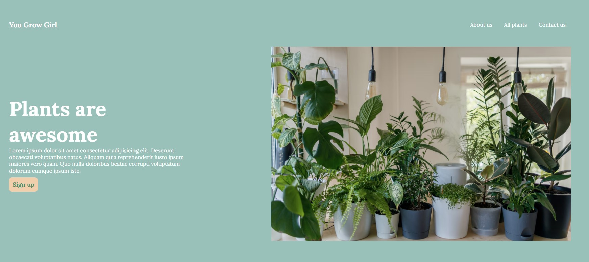
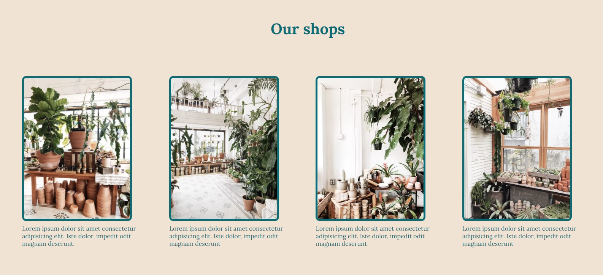

# Introduction
This is a [landing page project](https://www.theodinproject.com/paths/foundations/courses/foundations/lessons/landing-page) for the flexbox lession in the Fundamentals section of The Odin Project. It is also my first web development project.
# Objective
The objective is to use the provided image as a guide, and recreate a website using the skills learned in the section of the course. Instead of blindly following the guide, I decided to create a website for a fictional plant shop named *you grow girl*🪴 and add a bit of colour. 
## Provided guide

## My version of this project
##### Hero main

##### Info

##### Quote and call to action

#### Call to action and footer

# Skills used
- HTML
- CSS mainly flexbox
# Lessons learned
1. flex-direction confused me at first but I was able to grasp the idea by the quote section. 
2. Justify-content and align-items were also confusing at first. Reading the [MDN documentation](https://developer.mozilla.org/en-US/docs/Web/CSS/CSS_Flexible_Box_Layout/Aligning_Items_in_a_Flex_Container) really helped.  
3. Had a bit of trouble with call to action section for aligning the text on the left and the sign up button but was able to resolve it by creating divs.  
4. It took me 1-2 hours to complete the header and hero section, and I was worried that this project will take long to complete. However, I was able to finish quote through footer(3 sections) in 1-2 hours.
5. Basic formatting syntax for github and the use of git
# Future plans
- [ ] Make website responsive
- [ ] Fix info images to fit in the box proportionately 
- [ ] Update Readme
# Credit for images
- [Vadim Kaipov](https://unsplash.com/@vadimkaipov)
- [Fen Ivanova](https://unsplash.com/@fenivanova)

