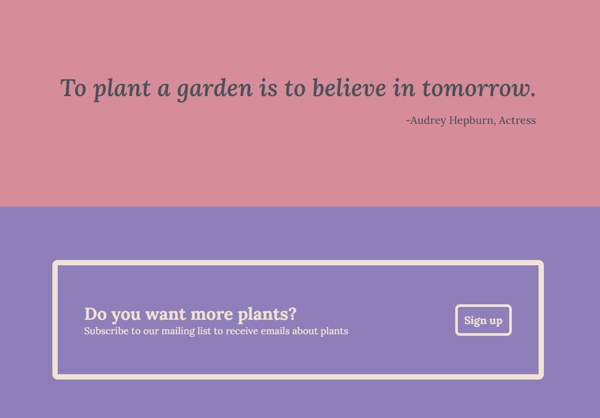

# Introduction
This is a [landing page project](https://www.theodinproject.com/paths/foundations/courses/foundations/lessons/landing-page) for the flexbox lession in the Fundamentals section of The Odin Project. 
# Objective
The objective is to use the provided image as a guide, and recreate a website using the skills learned in the section of the course. 
## Provided guide

## My version of this project
##### Hero main

##### Info

##### Quote and call to action

#### Call to action and footer

# Skills used
-HTML
-CSS mainly flexbox
# Lessons learned

# Future plans
-[]Make website responsive
-[]Update Readme
