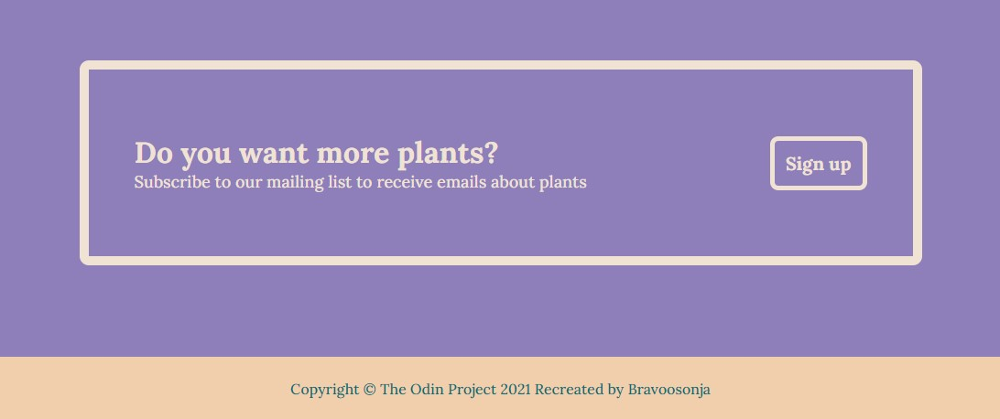

# Introduction
This is a [landing page project](https://www.theodinproject.com/paths/foundations/courses/foundations/lessons/landing-page) for the flexbox lession in the Fundamentals section of The Odin Project. 
# Objective
The objective is to use the provided image as a guide, and recreate a website using the skills learned in the section of the course. Instead of blindly following the guide, I decided to create a website for a fictional plant shop named *you grow girl.*
## Provided guide

## My version of this project
##### Hero main

##### Info

##### Quote and call to action

#### Call to action and footer

# Skills used
- HTML
- CSS mainly flexbox
# Lessons learned

# Future plans
- [ ] Make website responsive
- [ ] Fix info images to fit in the box proportionately 
- [ ] Update Readme
# Credit
## Images used

## Colour palette
